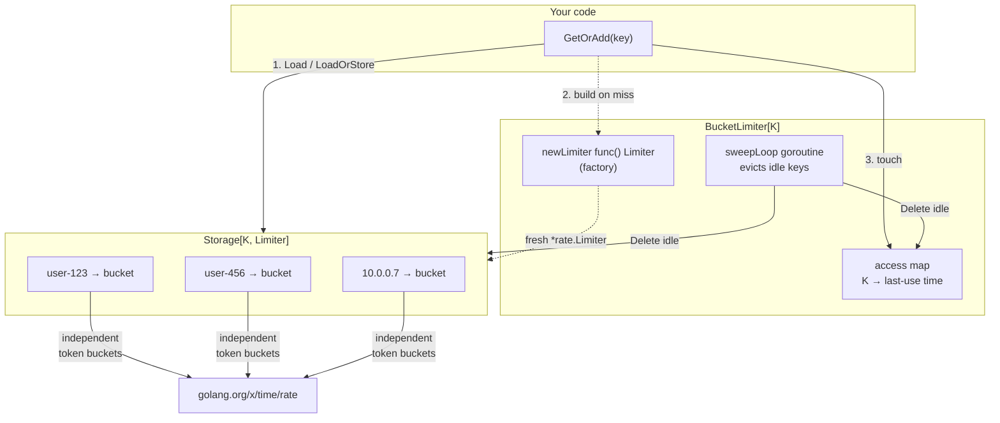
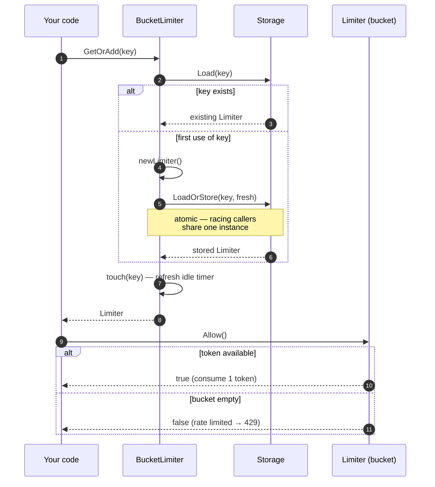

# ratelimiter

[](https://pkg.go.dev/github.com/slashdevops/ratelimiter)

[](https://github.com/slashdevops/ratelimiter/blob/main/LICENSE)
[](https://github.com/slashdevops/ratelimiter/actions/workflows/release.yml)
[](https://github.com/slashdevops/ratelimiter/actions/workflows/codeql.yml)

A flexible, goroutine-safe, **per-key** rate limiter for Go, built as a thin
manager around the token-bucket implementation in
[`golang.org/x/time/rate`](https://pkg.go.dev/golang.org/x/time/rate).

Each key (a user ID, API key, or IP address) gets its **own independent token
bucket**, so one client exhausting its budget never affects another. Limiters
are created lazily on first use and automatically evicted after they have been
idle for a configurable duration.

> **New to token buckets?** See [docs/TOKEN_BUCKET.md](docs/TOKEN_BUCKET.md) for
> a thorough, from-scratch explanation of the algorithm, how to choose `limit`
> and `burst`, and how the HTTP rate-limit headers work.
>
> **Upgrading from an earlier version?** See
> [docs/MIGRATION.md](docs/MIGRATION.md) for a before/after guide to the breaking
> API changes.

## Features

- **Per-key isolation** — a separate token bucket per identifier; keys never
  share a budget.
- **Token bucket algorithm** — sustained average rate plus configurable bursts,
  backed by the battle-tested `golang.org/x/time/rate`.
- **Goroutine-safe** — designed for concurrent use; key creation is atomic (no
  duplicate limiters under races).
- **Automatic idle eviction** — a single background goroutine removes limiters
  that have not been used for `deleteAfter`; active keys are kept alive. Stop it
  with `Close()`.
- **Type-safe & generic** — `Storage[K, V]` and `BucketLimiter[K]` use Go
  generics (Go 1.26+).
- **Extensible** — implement the `Storage` interface for a custom in-process
  store, or the `Limiter` interface for a custom algorithm (optionally adding
  `Reserver` for accurate `Retry-After`, even with a Redis/Valkey backend).
- **HTTP middleware example** — with accurate `Retry-After` and `RateLimit-*`
  response headers, driven by the backend-agnostic `Reserver` interface.

## Architecture

`BucketLimiter` is a thin manager: it maps each key to its own `Limiter`,
builds new ones on demand through a factory, persists them in a pluggable
`Storage`, and runs a single background goroutine that evicts idle keys.



Each key owns an **independent** token bucket, so one client draining its
budget has no effect on any other. A typical `GetOrAdd(key).Allow()` call:



## Installation

```bash
go get github.com/slashdevops/ratelimiter
```

Requires Go 1.26 or newer.

## Quick start

```go
package main

import (
	"fmt"
	"time"

	"github.com/slashdevops/ratelimiter"
	"golang.org/x/time/rate"
)

func main() {
	// A store that keeps one Limiter per key.
	storage := ratelimiter.NewInMemoryStorage[string, ratelimiter.Limiter]()

	// A factory that builds an independent bucket for each new key:
	// 5 requests/second sustained, absorbing bursts of up to 10.
	newLimiter := ratelimiter.NewRateLimiterFunc(rate.Limit(5), 10)

	// The manager. Limiters idle for 1 minute are evicted.
	manager := ratelimiter.NewBucketLimiter(newLimiter, time.Minute, storage)
	defer manager.Close() // stop the background eviction goroutine

	// Each key has its own bucket.
	if manager.GetOrAdd("user-123").Allow() {
		fmt.Println("allowed")
	} else {
		fmt.Println("rate limited")
	}
}
```

## Core concepts

| Type / func                        | Role                                                                       |
|------------------------------------|----------------------------------------------------------------------------|
| `Limiter`                          | Minimal interface (`Allow`, `Wait`, `Burst`). `*rate.Limiter` satisfies it. |
| `Reserver` / `Reservation`         | Optional capability: reserve a token and read its delay. Enables accurate `Retry-After` for any backend. |
| `RateLimiter`                      | Default limiter: wraps `*rate.Limiter`, implements `Limiter` **and** `Reserver`. |
| `Storage[K, V]`                    | Pluggable, concurrency-safe store for per-key limiters.                    |
| `InMemoryStorage[K, V]`            | Default `sync.Map`-backed store.                                            |
| `BucketLimiter[K]`                 | Manager: hands out one `Limiter` per key, handles creation and eviction.  |
| `NewRateLimiterFunc(limit, burst)` | Convenience factory producing `RateLimiter` values.                        |

### `limit` and `burst`

- **`limit`** (`rate.Limit`) — sustained refill rate in **tokens per second**.
  Use `rate.Every(d)` for "one every `d`", or `rate.Inf` for unlimited.
- **`burst`** (`int`) — bucket **capacity**: the largest number of requests
  allowed in a single instant.

See [docs/TOKEN_BUCKET.md](docs/TOKEN_BUCKET.md#choosing-parameters) for guidance
on choosing values.

## `Allow` vs. `Wait`

```go
lim := manager.GetOrAdd(key)

// Non-blocking: drop work when over the limit (e.g. HTTP 429).
if !lim.Allow() {
	// reject
}

// Blocking: shape work by waiting for a token (pass a ctx with a deadline).
if err := lim.Wait(ctx); err != nil {
	// ctx cancelled/expired
}
```

### Reserve (for accurate `Retry-After`)

When you need the exact delay until the next token — to set a `Retry-After` or
`RateLimit-Reset` header — use the optional `Reserver` capability. Feature-detect
it so your code works with any limiter and degrades gracefully:

```go
lim := manager.GetOrAdd(key)

if r, ok := lim.(ratelimiter.Reserver); ok {
	res := r.Reserve()
	if res.OK() && res.Delay() == 0 {
		// proceed now
	} else {
		res.Cancel()                 // return the token
		retryAfter := res.Delay()    // tell the client exactly how long to wait
	}
} else {
	_ = lim.Allow() // limiter without reservation support: no timing info
}
```

The default `RateLimiter` from `NewRateLimiterFunc` implements `Reserver`, and a
custom (e.g. Redis/Valkey-backed) `Limiter` can too — so the same middleware
produces accurate headers regardless of backend. See
[docs/CUSTOM_STORAGE.md](docs/CUSTOM_STORAGE.md#distributed-limiting-with-redis--valkey).

## HTTP middleware

The [`examples/middleware`](examples/middleware/main.go) program limits requests
per client IP and sets standard response headers:

- `RateLimit-Limit`, `RateLimit-Remaining`, `RateLimit-Reset` (IETF draft names,
  plus legacy `X-RateLimit-*`).
- `Retry-After` on `429`, computed from the actual reservation delay.

It also extracts the client IP with `net.SplitHostPort`, so it is correct for
both IPv4 and IPv6.

```bash
go run ./examples/middleware -limit 2 -burst 1
```

See [`examples/key`](examples/key/main.go) for a minimal, dependency-free demo of
per-key isolation and bucket refill over time:

```bash
go run ./examples/key -limit 1 -burst 3
```

## Custom storage

`BucketLimiter` talks to the `Storage[K, V]` interface, never a concrete map,
and you inject the implementation at construction time. `InMemoryStorage` is
just the bundled **default** — implement the interface to bring your own
in-process store (for example a size-bounded LRU to cap memory instead of, or in
addition to, time-based eviction). Implementations must be safe for concurrent
use, and `LoadOrStore` must be atomic.

```go
type Storage[K comparable, V any] interface {
	Store(key K, value V)
	Load(key K) (value V, ok bool)
	LoadOrStore(key K, value V) (actual V, loaded bool)
	Delete(key K)
	Range(f func(key K, value V) bool)
}
```

A complete, runnable size-bounded LRU store lives in
[`examples/customstorage`](examples/customstorage/main.go):

```bash
go run ./examples/customstorage -cap 2
```

**[docs/CUSTOM_STORAGE.md](docs/CUSTOM_STORAGE.md)** is a full guide: the method
contracts, how to test atomicity, and — importantly — why a custom `Storage` is
**in-process only**, plus the correct pattern for **distributed limiting with
Redis / [Valkey](https://github.com/valkey-io/valkey-go)** (a datastore-backed
`Limiter` wired through a `Storage` resolver, with the token-bucket Lua script).

## Scope: single-process only

Token state lives in memory inside each `*rate.Limiter`, so this library
enforces limits **within one process**. Running N instances behind a load
balancer yields an effective global limit of up to N × `limit`. Global,
cross-instance limiting requires a distributed algorithm (e.g. a Redis script)
and is out of scope. The `Storage` interface is for custom *in-process* stores,
not for synchronizing token state across machines. See
[docs/TOKEN_BUCKET.md](docs/TOKEN_BUCKET.md#single-process-vs-distributed).

## Testing

```bash
go test -race ./...
go test -bench . -benchmem ./...
```

## License

Apache License 2.0. See [LICENSE](LICENSE).
