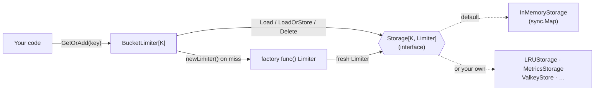
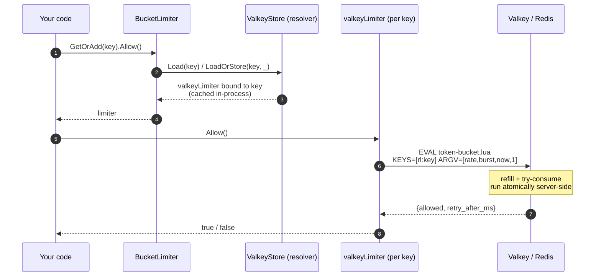

# Implementing a custom `Storage`

`BucketLimiter` never talks to a concrete map type. It talks to the
[`Storage[K, V]`](../storage.go) interface, and you inject the implementation at
construction time:

```go
manager := ratelimiter.NewBucketLimiter(newLimiter, time.Minute, storage)
//                                                              ▲
//                                          any Storage[K, Limiter] you like
```

The bundled [`InMemoryStorage`](../memory_store.go) is just the **default**
implementation, offered for convenience. Anyone can supply their own by
implementing the five-method interface — and if they don't, they use the default.

- [When to implement your own](#when-to-implement-your-own)
- [The interface and its contract](#the-interface-and-its-contract)
- [Where the store sits](#where-the-store-sits)
- [A complete in-process example: bounded LRU](#a-complete-in-process-example-bounded-lru)
- [Testing your implementation](#testing-your-implementation)
- [Storage is in-process — read this before reaching for Redis](#storage-is-in-process--read-this-before-reaching-for-redis)
- [Distributed limiting with Redis / Valkey](#distributed-limiting-with-redis--valkey)

## When to implement your own

Reach for a custom `Storage` when the default `sync.Map` doesn't fit how you want
to **hold the per-key limiters in memory**. Common reasons:

- **Bound memory for an unbounded key space** — cap the number of live keys with
  an LRU or a fixed-size ring, so per-IP limiting exposed to the internet cannot
  grow without limit. (This is the [example below](#a-complete-in-process-example-bounded-lru).)
- **Instrument the store** — count hits/misses, export metrics, or log key churn.
- **Change the backing structure** — a sharded map to cut lock contention, a
  `weak`-pointer store, an arena, etc.
- **Bind per-key metadata** — use the store as the seam that constructs
  key-aware limiters (this is what the [Valkey pattern](#distributed-limiting-with-redis--valkey)
  relies on).

If none of those apply, use `NewInMemoryStorage` — it is correct, atomic, and
fast.

## The interface and its contract

```go
type Storage[K comparable, V any] interface {
	Store(key K, value V)
	Load(key K) (value V, ok bool)
	LoadOrStore(key K, value V) (actual V, loaded bool)
	Delete(key K)
	Range(f func(key K, value V) bool)
}
```

Every implementation **MUST be safe for concurrent use by multiple goroutines.**
Beyond that:

| Method        | Contract                                                                                          | Called by the manager?                          |
|---------------|---------------------------------------------------------------------------------------------------|-------------------------------------------------|
| `Store`       | Unconditionally set `value` for `key`.                                                             | No — provided for completeness / your own use.  |
| `Load`        | Return the stored value and whether it was present.                                               | **Yes** — first thing `GetOrAdd` does.          |
| `LoadOrStore` | If `key` exists, return the existing value; else store and return the given one. **Must be atomic.** | **Yes** — the create-on-miss path in `GetOrAdd`. |
| `Delete`      | Remove `key`; deleting an absent key is a no-op.                                                   | **Yes** — from `Remove` and idle eviction.      |
| `Range`       | Call `f` for each entry until `f` returns `false`. Best-effort snapshot.                           | No — the manager tracks idle timers separately. |

Two consequences worth internalizing:

1. **`LoadOrStore` atomicity is load-bearing.** `GetOrAdd` relies on it so that
   two goroutines racing on a brand-new key both receive the *same* limiter
   instance — otherwise one client could momentarily get two independent buckets.
   Guard it with a mutex or use an atomic primitive (`sync.Map.LoadOrStore`).
2. **The manager only calls `Load`, `LoadOrStore`, and `Delete`.** It keeps its
   own last-use map for idle eviction, so it never calls your `Range`, and it
   never calls `Store`. You still must implement all five to satisfy the type,
   but only those three are on the hot path.

## Where the store sits



`BucketLimiter` is storage-agnostic: swap the box on the right and everything
else stays the same.

## A complete in-process example: bounded LRU

[`examples/customstorage`](../examples/customstorage/main.go) is a runnable,
size-bounded LRU store. It keeps at most `cap` distinct keys and evicts the
least-recently-used one on overflow — capping memory without relying on the
manager's time-based eviction.

```bash
go run ./examples/customstorage -cap 2
```

```
store capacity = 2

request alice  -> allowed=true
request bob    -> allowed=true
  [LRUStorage] capacity 2 exceeded, evicted alice
request carol  -> allowed=true
  [LRUStorage] capacity 2 exceeded, evicted bob
request alice  -> allowed=true
```

The shape of any in-process implementation is the same — a guarded map plus
whatever policy you want:

```go
type LRUStorage[K comparable, V any] struct {
	mu       sync.Mutex
	capacity int
	ll       *list.List           // front = most-recently-used
	items    map[K]*list.Element
}

func (s *LRUStorage[K, V]) LoadOrStore(key K, value V) (V, bool) {
	s.mu.Lock()
	defer s.mu.Unlock()
	if el, ok := s.items[key]; ok {      // already present → return it (atomic)
		s.ll.MoveToFront(el)
		return el.Value.(*lruEntry[K, V]).value, true
	}
	s.set(key, value)                     // insert; evict LRU if over capacity
	return value, false
}
// ... Store, Load, Delete, Range — see the example file for the full type.
```

> **Heads-up on eviction interaction.** If your store evicts a key that the
> manager still considers active, the next `GetOrAdd` simply rebuilds a fresh,
> full bucket via the factory — identical to what idle eviction does. That is
> usually fine, but if you want *only* size-based bounding, construct the manager
> with `deleteAfter <= 0` to turn off the time-based sweeper (as the example
> does).

## Testing your implementation

Two properties are worth an explicit test:

```go
// 1. LoadOrStore is atomic: N goroutines racing on one new key all get the
//    same instance.
func TestLoadOrStoreAtomic(t *testing.T) {
	s := NewMyStore[string, int]()
	const g = 100
	var wg sync.WaitGroup
	got := make([]int, g)
	for i := range g {
		wg.Add(1)
		go func(i int) {
			defer wg.Done()
			v, _ := s.LoadOrStore("k", i) // each offers a different value
			got[i] = v
		}(i)
	}
	wg.Wait()
	for _, v := range got {
		if v != got[0] {
			t.Fatalf("LoadOrStore not atomic: saw %d and %d", v, got[0])
		}
	}
}

// 2. Run the race detector against a Load/Store/Delete mix:
//      go test -race ./...
```

## Storage is in-process — read this before reaching for Redis

It is tempting to implement `Storage` on top of Redis or Valkey to get a
*distributed* limit shared across instances. **That does not work, and it is a
subtle footgun.** Here is why:

- What a `Storage` holds is the **`Limiter` object itself** — a live Go value
  (`*rate.Limiter`) whose token count lives in its own memory.
- Serializing that object into Redis and back gives every process (and every
  reload) its **own** counter. Nothing is shared. You would pay network latency
  for zero coordination.

The rule of thumb:

| You want…                                            | Extension point            |
|------------------------------------------------------|----------------------------|
| A different **in-process** store (LRU, metrics, …)   | implement **`Storage`**    |
| A different **algorithm** (leaky bucket, GCRA, …)    | implement **`Limiter`**    |
| A **global** limit shared across instances           | implement **`Limiter`** (backed by Redis/Valkey) |

Distributed limiting is a **`Limiter`** concern, not a `Storage` concern.

## Distributed limiting with Redis / Valkey

To share one budget across every instance, the *token math must run where the
state lives* — in the datastore, via an atomic server-side script. So you
implement the [`Limiter`](../limiter.go) interface (`Allow`, `Wait`, `Burst`)
backed by [valkey-go](https://github.com/valkey-io/valkey-go), and you use a
custom `Storage` as the **key→limiter resolver** so each limiter knows *its*
Valkey key.

> **Design note.** The `newLimiter func() Limiter` factory does not receive the
> key, and `Allow()`/`Wait()` take no key argument — so one `Limiter` instance
> represents exactly one key's bucket. The only injection point that sees both
> the **key** and a place to hold a **shared client** is `Storage.LoadOrStore`.
> That makes a custom `Storage` the natural seam: it caches one lightweight,
> key-bound Valkey limiter per key. This uses the store as a factory/cache
> rather than as a value container — a deliberate, supported reinterpretation
> for this use case. (If you would rather not reuse `BucketLimiter` at all, a
> ~30-line standalone manager over the same `valkeyLimiter` works too and keeps
> `Storage` out of it entirely.)

### The flow



Every instance shares the same Valkey key, so the limit is now **global**.

### The token-bucket script

This Lua runs atomically inside Valkey. It refills the bucket from elapsed time,
then tries to take one token. (Valkey keeps the `redis.*` scripting API for
compatibility.)

```lua
-- KEYS[1] = bucket key
-- ARGV[1] = rate    (tokens per second)
-- ARGV[2] = burst   (bucket capacity)
-- ARGV[3] = now_ms  (caller's clock, milliseconds)
-- ARGV[4] = cost    (tokens requested, usually 1)
-- returns { allowed (1/0), retry_after_ms }
local rate  = tonumber(ARGV[1])
local burst = tonumber(ARGV[2])
local now   = tonumber(ARGV[3])
local cost  = tonumber(ARGV[4])

local state  = redis.call('HMGET', KEYS[1], 'tokens', 'ts')
local tokens = tonumber(state[1])
local ts     = tonumber(state[2])
if tokens == nil then
  tokens = burst
  ts = now
end

-- continuous refill since the last update
tokens = math.min(burst, tokens + math.max(0, now - ts) / 1000.0 * rate)

local allowed, retry = 0, 0
if tokens >= cost then
  allowed = 1
  tokens = tokens - cost
else
  retry = math.ceil((cost - tokens) / rate * 1000.0)
end

redis.call('HSET', KEYS[1], 'tokens', tokens, 'ts', now)
-- let idle buckets expire once they would be full again
redis.call('PEXPIRE', KEYS[1], math.ceil(burst / rate * 1000.0) + 1000)
return { allowed, retry }
```

### The `Limiter` implementation

> The snippet below targets `github.com/valkey-io/valkey-go`. It is **illustrative** —
> it is intentionally *not* compiled into this module (the library has no Valkey
> dependency). Drop it into your own package, add `valkey-go` to your `go.mod`,
> and test it against a real server before relying on it.

```go
package valkeylimiter

import (
	"context"
	"strconv"
	"time"

	"github.com/slashdevops/ratelimiter"
	"github.com/valkey-io/valkey-go"
)

var script = valkey.NewLuaScript(tokenBucketLua) // the Lua from above

// valkeyLimiter implements ratelimiter.Limiter against a shared Valkey bucket.
type valkeyLimiter struct {
	client valkey.Client
	key    string  // the Valkey key, e.g. "rl:user-123"
	rate   float64 // tokens per second
	burst  int
}

func (l *valkeyLimiter) Burst() int { return l.burst }

func (l *valkeyLimiter) Allow() bool {
	allowed, _, err := l.eval(context.Background(), 1)
	// Fail-open or fail-closed on transport errors is your policy choice.
	return err == nil && allowed
}

func (l *valkeyLimiter) Wait(ctx context.Context) error {
	for {
		allowed, retry, err := l.eval(ctx, 1)
		if err != nil {
			return err
		}
		if allowed {
			return nil
		}
		select {
		case <-ctx.Done():
			return ctx.Err()
		case <-time.After(retry):
		}
	}
}

func (l *valkeyLimiter) eval(ctx context.Context, cost int) (allowed bool, retry time.Duration, err error) {
	now := strconv.FormatInt(time.Now().UnixMilli(), 10)
	res := script.Exec(ctx, l.client, []string{l.key}, []string{
		strconv.FormatFloat(l.rate, 'f', -1, 64),
		strconv.Itoa(l.burst),
		now,
		strconv.Itoa(cost),
	})
	arr, err := res.ToArray()
	if err != nil {
		return false, 0, err
	}
	ok, _ := arr[0].ToInt64()
	ms, _ := arr[1].ToInt64()
	return ok == 1, time.Duration(ms) * time.Millisecond, nil
}

// Compile-time check.
var _ ratelimiter.Limiter = (*valkeyLimiter)(nil)
```

### Accurate `Retry-After`: implement `Reserver` too

The [`Reserver`](../reservation.go) interface lets HTTP middleware read the exact
delay until the next token and emit accurate `Retry-After` / `RateLimit-Reset`
headers **for any backend** — the [middleware example](../examples/middleware/main.go)
feature-detects it. Your Lua script already returns `retry_after_ms`, so exposing
it is a few lines and makes the Valkey limiter a first-class citizen of that
middleware (instead of degrading to `Allow`-only):

```go
type valkeyReservation struct {
	limiter *valkeyLimiter
	ok      bool
	delay   time.Duration
}

func (r valkeyReservation) OK() bool           { return r.ok }
func (r valkeyReservation) Delay() time.Duration { return r.delay }
func (r valkeyReservation) Cancel()            { /* optional: return the token via a compensating EVAL */ }

func (l *valkeyLimiter) Reserve() ratelimiter.Reservation {
	allowed, retry, err := l.eval(context.Background(), 1)
	if err != nil {
		return valkeyReservation{limiter: l, ok: false}
	}
	// allowed -> delay 0; otherwise the caller waits retry before the token is valid.
	return valkeyReservation{limiter: l, ok: true, delay: retry}
}

var _ ratelimiter.Reserver = (*valkeyLimiter)(nil)
```

> `Cancel` is best-effort for a distributed limiter: returning a token means an
> extra round-trip (a compensating script that credits one token back). If you
> reserve-then-reject on every over-limit request, a cheap option is to not
> pre-consume in `Reserve` at all — compute the delay with a read-only variant of
> the script and only consume in `Allow`. Choose the trade-off that fits your
> accuracy vs. round-trip budget.

### Wiring it through a `Storage` resolver

The store injects the shared client and binds the key. It ignores the
in-memory value the manager passes (that throwaway `*rate.Limiter`) and returns
the Valkey-backed limiter instead — caching one per key:

```go
type ValkeyStore struct {
	client valkey.Client
	rate   float64
	burst  int

	mu    sync.Mutex
	cache map[string]ratelimiter.Limiter
}

func NewValkeyStore(c valkey.Client, r float64, burst int) *ValkeyStore {
	return &ValkeyStore{client: c, rate: r, burst: burst, cache: map[string]ratelimiter.Limiter{}}
}

func (s *ValkeyStore) LoadOrStore(key string, _ ratelimiter.Limiter) (ratelimiter.Limiter, bool) {
	s.mu.Lock()
	defer s.mu.Unlock()
	if l, ok := s.cache[key]; ok {
		return l, true
	}
	l := &valkeyLimiter{client: s.client, key: "rl:" + key, rate: s.rate, burst: s.burst}
	s.cache[key] = l
	return l, false
}

func (s *ValkeyStore) Load(key string) (ratelimiter.Limiter, bool) {
	s.mu.Lock()
	defer s.mu.Unlock()
	l, ok := s.cache[key]
	return l, ok
}

func (s *ValkeyStore) Store(key string, v ratelimiter.Limiter) { /* mu + s.cache[key] = v */ }
func (s *ValkeyStore) Delete(key string)                       { /* mu + delete(s.cache, key) */ }
func (s *ValkeyStore) Range(f func(string, ratelimiter.Limiter) bool) { /* mu + iterate */ }
```

Then assemble as usual. Because the store supplies the real limiter, the
`newLimiter` factory is never meaningfully used — pass a trivial one:

```go
client, _ := valkey.NewClient(valkey.ClientOption{InitAddress: []string{"127.0.0.1:6379"}})
defer client.Close()

store := NewValkeyStore(client, 5, 10) // 5 rps, burst 10 — shared across instances
noop := func() ratelimiter.Limiter { return nil } // ignored by ValkeyStore.LoadOrStore

manager := ratelimiter.NewBucketLimiter(noop, time.Minute, store)
defer manager.Close()

if manager.GetOrAdd("user-123").Allow() { // consults Valkey atomically
	// handle request
}
```

Now `user-123` draws from **one** bucket no matter which instance serves the
request. The manager's idle eviction still runs — it just evicts the cheap
in-process `valkeyLimiter` wrapper from `ValkeyStore`, while the authoritative
state (and its own TTL) lives in Valkey.

### Redis instead of Valkey

The same design works with any Redis client (`go-redis/redis`,
`redis/rueidis`, …): the Lua script is unchanged, only the `Exec`/`EVAL` call
differs. If you would rather not hand-roll the script at all, a purpose-built
library such as [`go-redis/redis_rate`](https://github.com/go-redis/redis_rate)
implements a GCRA limiter over Redis and may be the faster path to production.
