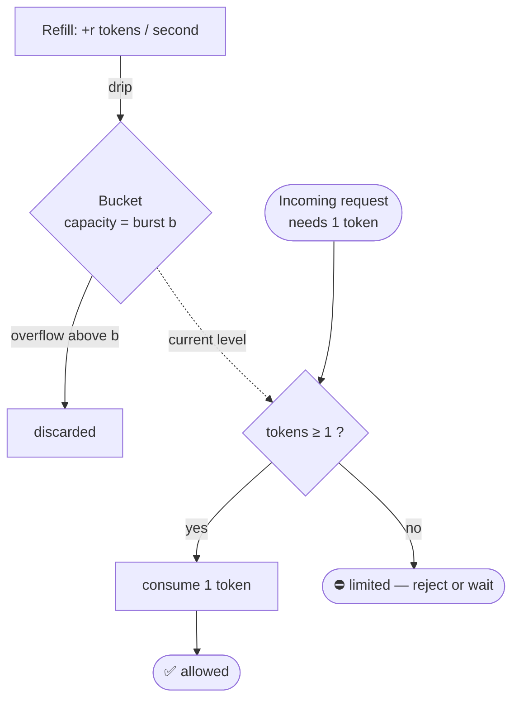
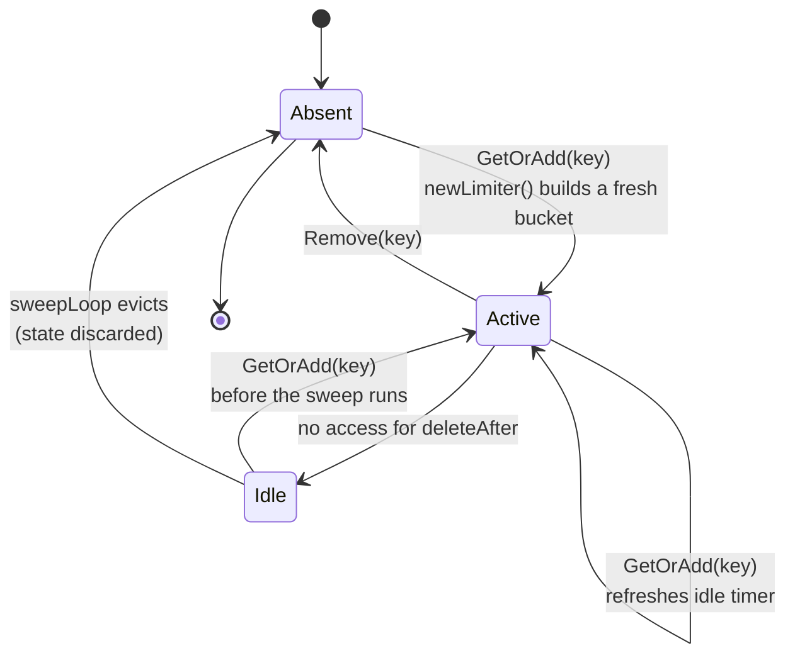
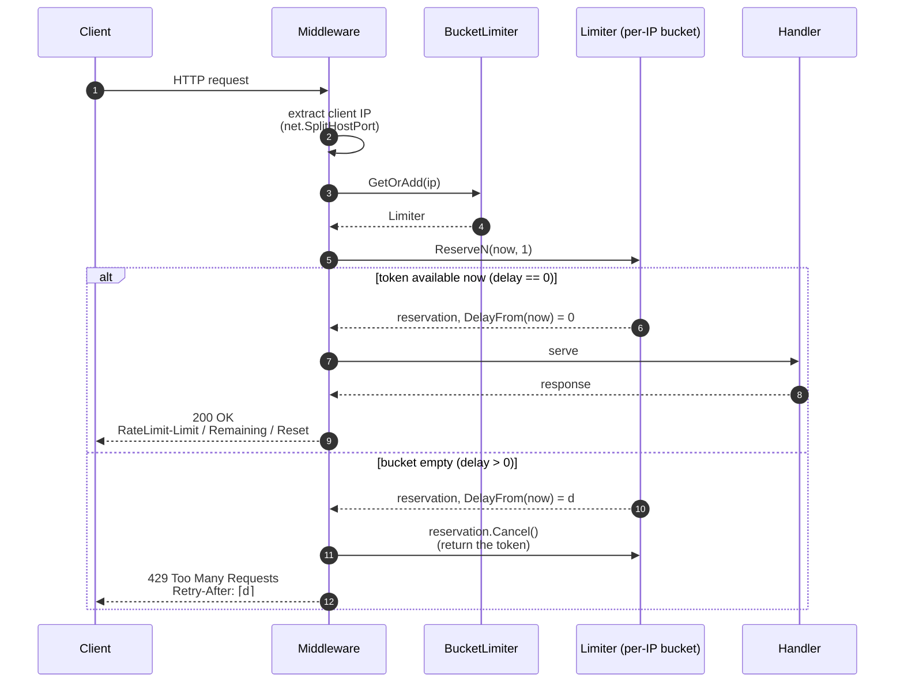

# Rate limiting with the token bucket algorithm

This document explains the algorithm behind `ratelimiter`, how to choose its
parameters, and how those parameters behave in practice. It is written to be
useful even if you have never implemented a rate limiter before.

- [Why rate limit at all?](#why-rate-limit-at-all)
- [The token bucket, intuitively](#the-token-bucket-intuitively)
- [The two parameters: rate and burst](#the-two-parameters-rate-and-burst)
- [How the math works](#how-the-math-works)
- [Allow vs. Wait vs. Reserve](#allow-vs-wait-vs-reserve)
- [Choosing parameters](#choosing-parameters)
- [Per-key limiting](#per-key-limiting)
- [Eviction of idle keys](#eviction-of-idle-keys)
- [HTTP response headers](#http-response-headers)
- [Comparison with other algorithms](#comparison-with-other-algorithms)
- [Single-process vs. distributed](#single-process-vs-distributed)
- [Further reading](#further-reading)

## Why rate limit at all?

A rate limiter caps how often an operation may happen. It is the tool you reach
for to:

- **Protect a resource** — a database, an upstream API, a payment provider — from
  being overwhelmed.
- **Enforce fairness** — stop a single user, IP, or API key from consuming a
  shared service's whole capacity.
- **Contain abuse and cost** — throttle brute-force login attempts, scrapers, or
  runaway retries; keep metered-API spend predictable.
- **Smooth traffic** — turn spiky arrivals into a steady stream your backend can
  actually handle.

The hard part is allowing *normal* bursts (users legitimately click twice, retry
once) while still enforcing a sustainable long-run average. The token bucket is
popular precisely because it expresses both in two numbers.

## The token bucket, intuitively

Picture a bucket that holds tokens:

```
        tokens drip in at a fixed rate (r per second)
                     │
                     ▼
              ┌───────────────┐
              │   ● ● ● ●      │  ← capacity = burst (b)
              │   ● ●          │     the bucket never holds more than b
              └───────┬───────┘
                      │  each request removes 1 token
                      ▼
             request allowed  (token available)
             request limited  (bucket empty)
```

The same idea as a flow diagram:



Rules:

1. Tokens are added to the bucket at a steady **rate** `r` (tokens per second).
2. The bucket can hold at most **burst** `b` tokens. Extra drips overflow and are
   lost — the bucket never exceeds its capacity.
3. Each request tries to take 1 token. If one is available, the request is
   **allowed** and a token is removed. If the bucket is empty, the request is
   **limited** (rejected, or made to wait).

Two consequences fall out of these rules:

- **Long-run average** is capped at `r` requests per second — you cannot take
  tokens faster than they drip in.
- **Short bursts** up to `b` are allowed instantly, because a full or partly
  full bucket lets several requests through back-to-back before it empties.

## The two parameters: rate and burst

`ratelimiter` builds each key's bucket with
[`golang.org/x/time/rate`](https://pkg.go.dev/golang.org/x/time/rate) via
`NewRateLimiterFunc(limit, burst)`:

| Parameter | Type        | Meaning                                                        |
|-----------|-------------|----------------------------------------------------------------|
| `limit`   | `rate.Limit`| Refill rate in **tokens per second**. The sustained average.   |
| `burst`   | `int`       | Bucket **capacity**. The largest instantaneous burst allowed.  |

Helpers for expressing the rate:

```go
rate.Limit(5)        // 5 tokens per second
rate.Every(200*time.Millisecond) // 1 token every 200ms == 5/sec
rate.Inf             // unlimited (every request allowed)
```

> Note: `burst` is the maximum tokens available *at a single instant*, not a
> per-second quota. "10 requests per second" is `limit = 10`; how bursty that is
> allowed to be is a separate choice you make with `burst`.

## How the math works

The bucket does not literally run a background ticker per request. `x/time/rate`
computes the token count lazily from elapsed time, which is exact and cheap:

- Tokens available at time `t`:
  `tokens(t) = min(b, tokens(t₀) + r · (t − t₀))`
  where `t₀` is the last time the bucket was updated.
- A request for 1 token at time `t` succeeds immediately if `tokens(t) ≥ 1`.
- If not, the time until a token is available is
  `wait = (1 − tokens(t)) / r`.

Worked example — `limit = 2/sec`, `burst = 1`, requests arrive as fast as
possible:

| Request | Time    | Tokens before | Result   | Notes                         |
|---------|---------|---------------|----------|-------------------------------|
| 1       | 0.00s   | 1.0           | allowed  | consumes the single burst token |
| 2       | 0.00s   | 0.0           | limited  | must wait `1/2 s`             |
| 3       | 0.50s   | 1.0           | allowed  | one token refilled            |
| 4       | 1.00s   | 1.0           | allowed  | steady state: one every 0.5s  |

With `burst = 5` instead, the first **five** requests at `t = 0` are allowed
(the full bucket), then the rate settles to one every 0.5s.

## Allow vs. Wait vs. Reserve

The same bucket can be consumed three ways. `ratelimiter.Limiter` exposes the
first two; the underlying `*rate.Limiter` also offers `Reserve`.

- **`Allow() bool`** — non-blocking. Returns `true` and consumes a token if one
  is available, else `false`. Use it to **drop** work on overload (HTTP 429,
  shed load). This is the common choice for request throttling.
- **`Wait(ctx) error`** — blocking. Sleeps until a token is available or `ctx`
  is cancelled/expired. Use it to **shape** work — a background job or client
  that should slow down rather than fail. Beware unbounded goroutine buildup if
  arrivals persistently exceed `r`; always pass a `ctx` with a deadline.
- **`Reserve()` / `ReserveN()`** (on `*rate.Limiter`) — reserves a token and
  tells you the `Delay()` until it becomes valid, without blocking. This is what
  the middleware example uses to compute an accurate `Retry-After`. If you decide
  not to proceed, call `reservation.Cancel()` to return the token.

## Choosing parameters

Start from the resource you are protecting and the behavior you want:

- **Sustained rate (`limit`)** = the average throughput the protected resource
  can handle indefinitely, divided across the number of keys you expect. If your
  database tolerates 1,000 writes/sec and you limit per user, `limit` is the
  per-user share you are willing to grant.
- **Burst (`burst`)** = how much slack you allow for legitimate spikes. Rules of
  thumb:
  - `burst = 1` → strict spacing, essentially "no two requests closer than `1/r`
    seconds". Harsh on normal users (double-clicks fail).
  - `burst` = a few seconds' worth of rate (`≈ r · 2..5`) → absorbs normal
    spikes while still capping the average. A good default for user-facing APIs.
  - Large `burst` → very permissive spikes; only the long-run average is
    enforced. Use when spikiness is expected and the resource can absorb it.

Concrete starting points:

| Use case                          | `limit`             | `burst` |
|-----------------------------------|---------------------|---------|
| Public API per API key            | `rate.Limit(10)`    | `20`    |
| Login / auth endpoint per IP      | `rate.Every(time.Second)` (`1/s`) | `5` |
| Expensive report generation/user  | `rate.Every(time.Minute)` (`1/min`) | `2` |
| Internal service-to-service       | `rate.Limit(1000)`  | `200`   |

Then load-test and adjust. The two knobs are independent: raise `burst` for
friendlier spikes, raise `limit` for more sustained throughput.

## Per-key limiting

`BucketLimiter` keeps a **separate bucket per key** (a user ID, API key, or IP).
`GetOrAdd(key)` returns that key's limiter, creating it with your factory on
first use:

```go
storage := ratelimiter.NewInMemoryStorage[string, ratelimiter.Limiter]()
manager := ratelimiter.NewBucketLimiter(
    ratelimiter.NewRateLimiterFunc(rate.Limit(5), 10),
    time.Minute,
    storage,
)
defer manager.Close()

if manager.GetOrAdd(userID).Allow() {
    // ... handle request
}
```

Because each key has its own bucket, one client draining its budget has **no
effect** on any other client. Creation is atomic: if two goroutines ask for the
same brand-new key simultaneously, both receive the same limiter instance.

## Eviction of idle keys

An unbounded number of keys (for example, per-IP limiting exposed to the
internet) would leak memory if buckets lived forever. `BucketLimiter` tracks
each key's last-use time and a single background goroutine evicts keys idle for
longer than `deleteAfter`:

- Every access through `GetOrAdd` refreshes the key's idle timer, so **actively
  used keys are never evicted**.
- The sweep runs every `deleteAfter/2` by default (tune with
  `WithSweepInterval`). Worst case, a key is removed up to ~1.5·`deleteAfter`
  after its last use.
- Set `deleteAfter <= 0` to disable eviction entirely — only for **bounded** key
  spaces, where the total number of distinct keys is small and known.
- Call `Close()` when done to stop the goroutine.

Eviction resets state: after a key is removed, the next `GetOrAdd` builds a fresh
full bucket. Choose `deleteAfter` comfortably longer than the window over which
you want the limit to hold (e.g. minutes, not milliseconds) so a client cannot
reset its own bucket by pausing briefly.

The lifecycle of a single key:



The sweep is not instantaneous, so a key idle past `deleteAfter` lingers until
the next tick — worst case ~1.5·`deleteAfter` after its last use with the
default interval.

## HTTP response headers

Well-behaved HTTP clients can self-throttle if you tell them the state of their
bucket. The middleware example sets, on every response:

| Header                | Meaning                                                    |
|-----------------------|------------------------------------------------------------|
| `RateLimit-Limit`     | Bucket capacity (`burst`) for this client.                 |
| `RateLimit-Remaining` | Whole tokens currently available.                          |
| `RateLimit-Reset`     | Seconds until a token is expected to be available.         |
| `Retry-After`         | On `429` only: seconds to wait before retrying.            |

The `RateLimit-*` names follow the IETF draft
[*RateLimit header fields for HTTP*](https://datatracker.ietf.org/doc/draft-ietf-httpapi-ratelimit-headers/);
the example also emits the legacy `X-RateLimit-*` variants for older clients.
`Retry-After` is standardized in
[RFC 9110 §10.2.3](https://www.rfc-editor.org/rfc/rfc9110#section-10.2.3) and is
computed from the reservation delay so it is accurate rather than a guess.

End to end, a request through the middleware:



## Comparison with other algorithms

| Algorithm            | Bursts | Memory/key | Notes                                           |
|----------------------|--------|------------|-------------------------------------------------|
| **Token bucket**     | Yes    | O(1)       | This library. Smooth average + bounded burst.   |
| Leaky bucket         | No     | O(1)       | Enforces a strictly constant output rate.       |
| Fixed window counter | Spiky  | O(1)       | Simple, but allows 2× burst at window edges.    |
| Sliding window log   | Exact  | O(requests)| Precise but stores every timestamp.             |
| Sliding window count | Good   | O(1)       | Approximates the log cheaply; common in Redis.  |

The token bucket is the usual default: O(1) per key, allows configurable bursts,
and enforces a clean long-run average without the edge-of-window doubling that
fixed windows suffer from.

## Single-process vs. distributed

This library limits within a **single process**: the token state lives in memory
inside each `*rate.Limiter`. If you run N instances behind a load balancer, each
enforces the limit independently, so the effective global limit is up to N·`r`.

For a *global* limit shared across instances you need a distributed algorithm
(commonly a sliding-window or token-bucket script in Redis, or a dedicated rate
limiting service). That is deliberately out of scope here — the `Storage`
interface exists to plug in custom **in-process** stores (e.g. a size-bounded
LRU), not to synchronize token state across machines.

## Further reading

- `golang.org/x/time/rate` package docs — <https://pkg.go.dev/golang.org/x/time/rate>
- Token bucket — <https://en.wikipedia.org/wiki/Token_bucket>
- Leaky bucket — <https://en.wikipedia.org/wiki/Leaky_bucket>
- IETF RateLimit header fields — <https://datatracker.ietf.org/doc/draft-ietf-httpapi-ratelimit-headers/>
- RFC 9110 (HTTP semantics, `Retry-After`, `429`) — <https://www.rfc-editor.org/rfc/rfc9110>
